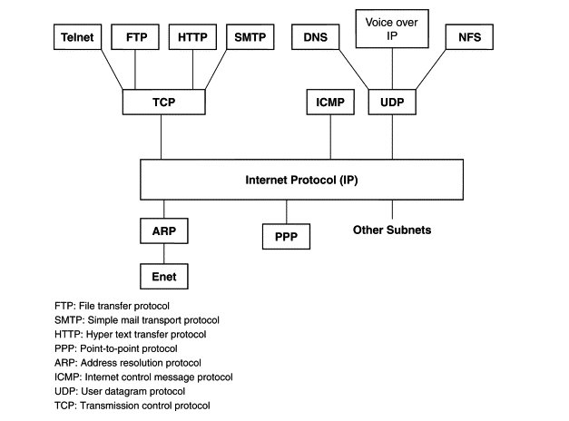

# Protocols

## Internet Protocol suite

The internet protocol suite is a collection of different protocols, or methods, for devices to communicate with each other.
Both TCP and UDP are major protocols within the internet protocol suite:

Each device that's connected to the internet has a unique IP address. And whenever two devices communicate over the internet, they're likely using either TCP or UDP to do so.

### TCP

TCP, or Transmission Control Protocol, is the most common networking protocol online.
TCP is extremely reliable, and is used for everything from surfing the web (HTTP), sending emails (SMTP), and transferring files (FTP).

TCP is used in situations where it's necessary that all data being sent by one device is received by another completely intact.

For example, when you visit a website, TCP is used to guarantee that everything from the text, images, and code needed to render the page arrives. Without TCP, images or text could be missing, or arrive in the incorrect order, breaking the page.

TCP is a connection-oriented protocol, meaning that it establishes a connection between two devices before transferring data, and maintains that connection throughout the transfer process.

To establish a connection between two devices, TCP uses a method called a three-way handshake:

### UDP

UDP, or User Datagram Protocol, is another one of the major protocols that make up the internet protocol suite. UDP is less reliable than TCP, but is much simpler.

UDP is used for situations where some data loss is acceptable, like live video/audio, or where speed is a critical factor like online gaming.

While UDP is similar to TCP in that it's used to send and receive data online, there are a couple of key differences.

First, UDP is a connectionless protocol, meaning that it does not establish a connection beforehand like TCP does with its three-way handshake.

Next, UDP doesn't guarantee that all data is successfully transferred.
With UDP, data is sent to any device that happens to be listening, but it doesn't care if some of it is lost along the way.
This is one of the reasons why UDP is also known as the "fire-and-forget" protocol.

UDP is more like a protester outside with a megaphone.
Everyone who is paying attention to the protester should hear most of what they're saying.
But there's no guarantee that everyone in the area will hear what the protester is saying, or that they're even listening.

## References

[1] [Internet Protocol Suite](https://www.sciencedirect.com/topics/computer-science/internet-protocol-suite)
